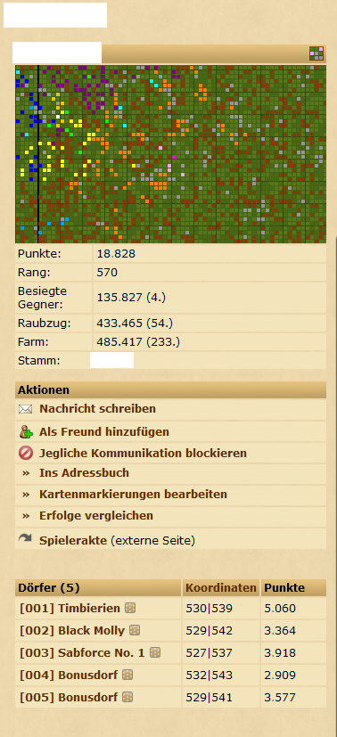

# BetterPlayerInfo

Fetches the farm and rz stats for a player and displays them on his profile. Also makes the coordinates table header interactive. When you click on it all village coordinates are copied to the clipboard.

Latest build can be found [here](https://github.com/LegendaryB/tw-userscripts/tree/main/dist/BetterPlayerInfo/userscript.js) (insert it into Tampermonkey)

## 🚀 How to use it?
Navigate to a player profile

