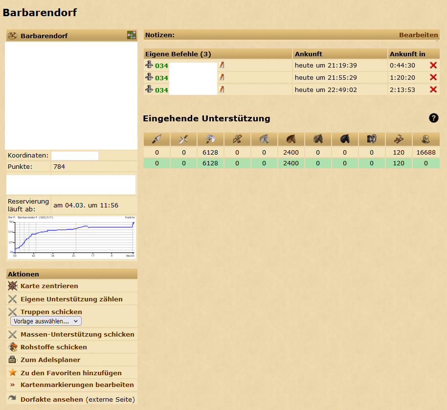

# CountOwnSupport

Script to count own incoming support for a single village.

Latest build can be found [here](https://github.com/LegendaryB/tw-userscripts/tree/main/dist/CountOwnSupport/CountOwnSupport.user.js)

