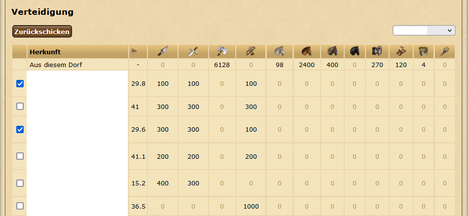

# SelectSupportingPlayer

Script which extends the defense overview screen of a single village with a select box to select all supports of a specific player.

Latest build can be found [here](https://github.com/LegendaryB/tw-userscripts/tree/main/dist/SelectSupportingPlayer/SelectSupportingPlayer.user.js)

