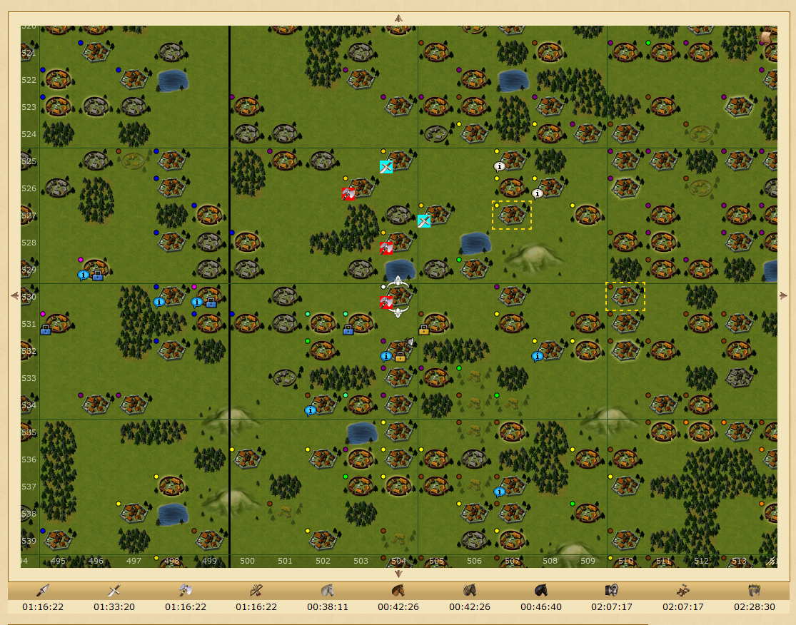

# VillageDistanceCalculator

Shows the distance between two selected villages

Latest build can be found [here](https://github.com/LegendaryB/tw-userscripts/tree/main/dist/VillageDistanceCalculator/userscript.js) (insert it into Tampermonkey)

## 🚀 How to use it?
Navigate to the map, press the hotkey 'd' and click the two villages

